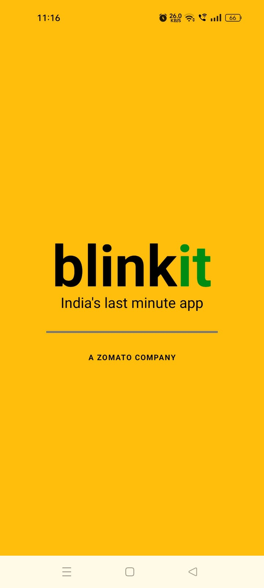
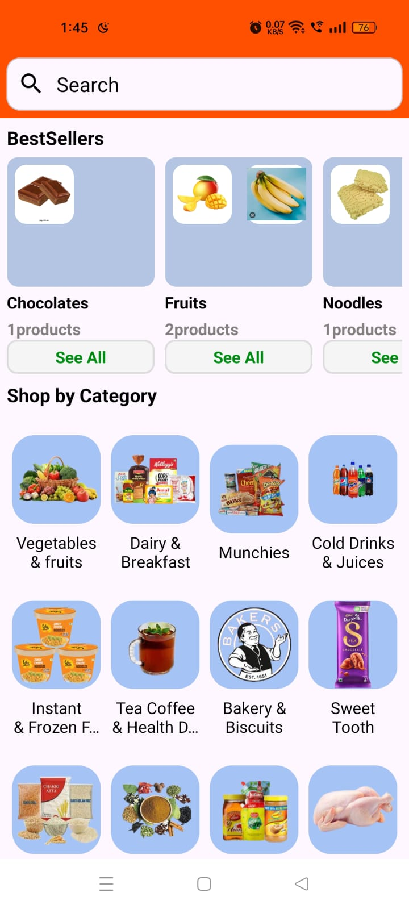
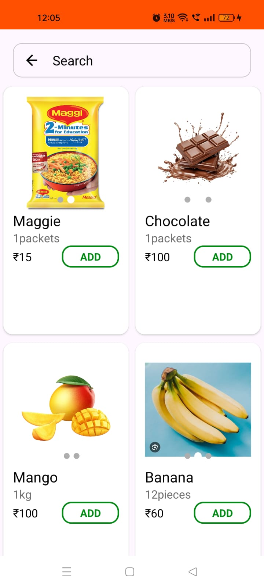
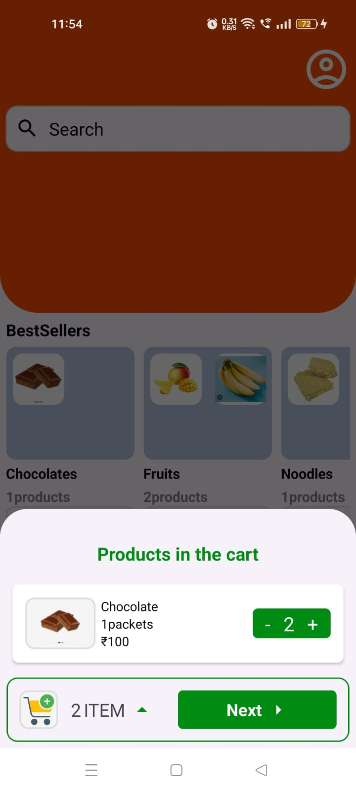
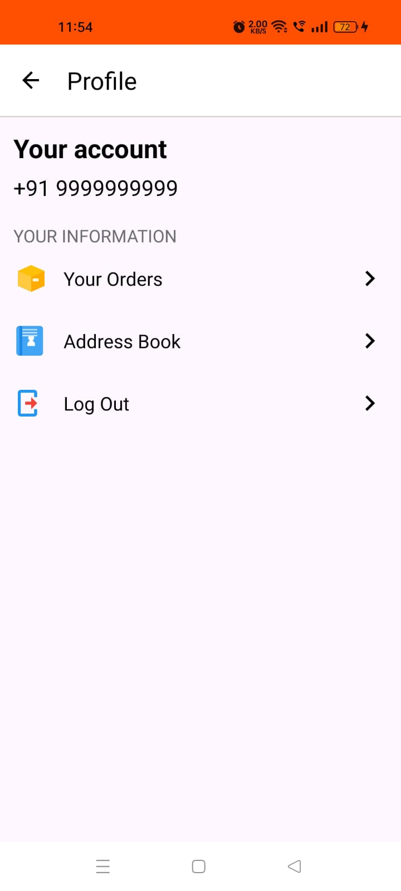

# 🛒 Blinkit Clone - User App

An Android app that replicates the user-side of the Blinkit grocery delivery platform — fully functional and built using **Kotlin** and **Firebase**. This app enables users to browse items, search, filter by category, add to cart, place orders, track them in real-time, and view past orders — all in a seamless experience.

## 🚀 Features

- 🔐 **User Authentication** – Secure login/signup using Firebase Auth  
- 🗂️ **Category Filtering** – Browse items by categories  
- 🔍 **Product Search** – Real-time keyword search  
- 🛒 **Cart System** – Add, update, and remove items from the cart  
- 📦 **Order Placement** – Place orders and sync them to Firebase  
- 📍 **Order Tracking** – Track order status updates live  
- 🧾 **Order History** – View past orders and their statuses  
- 💳 **PhonePe Payment Integration** – Simulated UPI-based payments  
- 🖼️ **Product Images** – Uploaded and displayed via Firebase Storage  
- ✨ **Shimmer Loading Effect** – Smooth loading UI transitions  
- 🌙 **Dark Mode Support** – Fully responsive UI in light/dark themes  
- ☁️ **Firebase Realtime DB** – Instant data sync and retrieval  

## 📷 Screenshots

  
  
  
  
  
  

## ⚙️ Built With

- **Kotlin**
- **Firebase (Auth, Realtime Database, Storage)**
- **XML-based UI**
- **MVVM Architecture**
- **Glide** (for image loading)
- **PhonePe SDK (Simulated)**

## 📚 What I Learned

- Firebase setup and deep integration  
- User session handling and authentication flow  
- Real-time product sync and CRUD in Firebase  
- Cart logic, order flows, and state management  
- Image uploads to and downloads from Firebase Storage  
- Payment logic with UPI simulation  
- Creating shimmer effects for loading states  
- Clean architecture patterns with MVVM and LiveData  
- Adaptive UI with dark mode support  

## 🛠️ Topics Covered

- Kotlin Android Development  
- Firebase Auth & Realtime DB  
- MVVM Architecture  
- LiveData & ViewModel  
- RecyclerView Adapter Patterns  
- Firebase Storage Integration  
- Cart Management & Quantity Handling  
- Shimmer UI Effect  
- Order Tracking System  
- Order History View  
- UPI/PhonePe Payment Flow (Simulated)  
- ConstraintLayout XML Design  
- Navigation & Intents  
- Glide Image Loading  
- Gradle Kotlin DSL  
- GitHub Project Management  
- XML UI Optimization  
- Secure Firebase Rules  
- Adaptive Dark Mode Support  
- Dependency Injection (basic level)

## 🔮 Future Enhancements

- 📍 Add address selection with Google Maps  
- 🔔 Push notifications for order updates  
- 💬 Integrate user chat support  
- 📊 Admin analytics dashboard sync  

---

👩‍💻 Built with ❤️ by [@Nikki1930](https://github.com/Nikki1930)  
This app is a **passion project** aimed at mastering Android development using real-world use cases.
